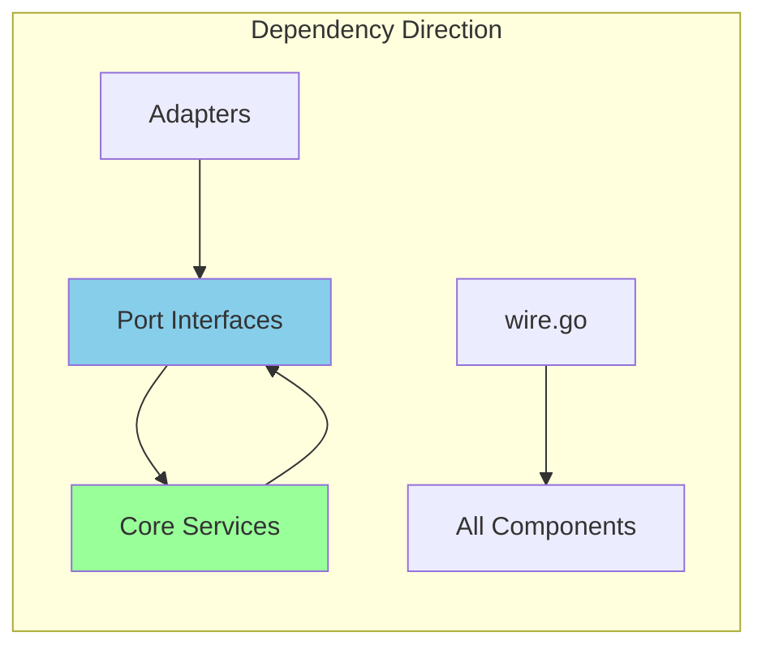
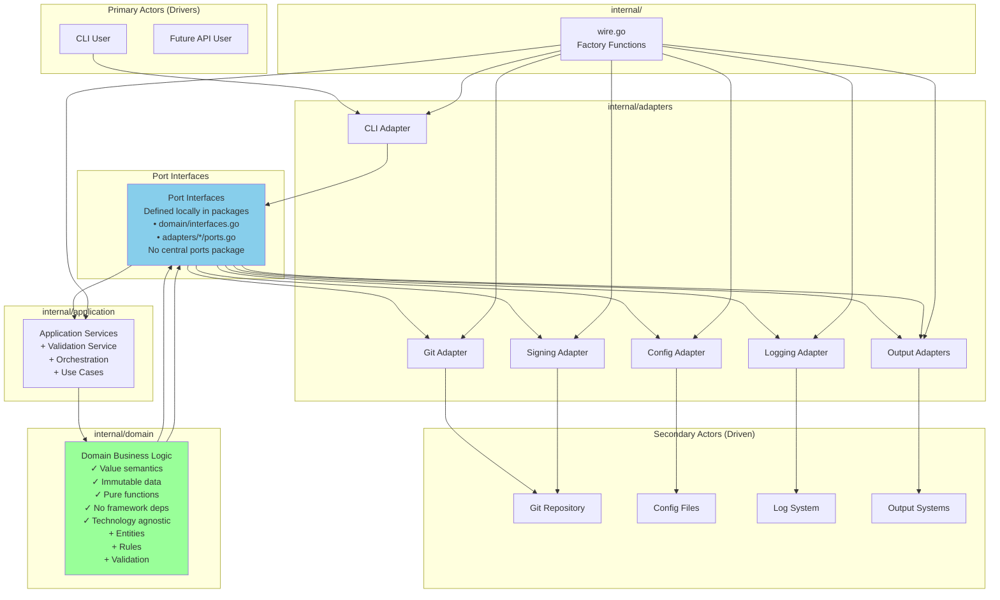
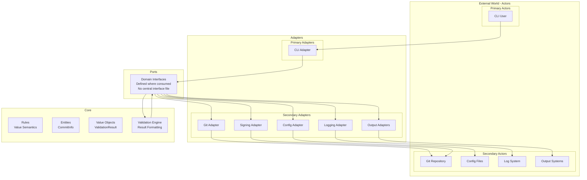

# Architecture

Gommitlint follows a **functional hexagonal architecture** with value semantics throughout, ensuring clean separation of concerns, testability, and maintainability.

## Core Principles

1. **Hexagonal Architecture** - Clear separation between core logic and adapters
2. **Functional Programming** - Pure functions, immutability, and value semantics
3. **Single Context Pattern** - Context flows from main through the entire application
4. **Table-Driven Testing** - Consistent test patterns with `testCase` naming
5. **Core-First Design** - Business logic is isolated from infrastructure

## Architecture Overview

### Hexagonal Architecture (Ports and Adapters)

The architecture follows the hexagonal pattern with clear separation of concerns. The hexagon represents the application itself, containing all business logic with no references to technology or frameworks.

### Actors

Outside the hexagon we have **actors** - the real world entities that interact with the application:

#### Primary Actors (Drivers)

Located on the left/top side. The interaction is triggered by the actor:

- **CLI Users**: Humans using command line interface
- **Test Frameworks**: Automated tests that validate the application

#### Secondary Actors (Driven)

Located on the right/bottom side. The interaction is triggered by the application:

- **Git Repository** (Repository type): Application reads commit information from it
- **Configuration Files** (Repository type): Application reads configuration from them
- **Log Systems** (Recipient type): Application sends log messages to them
- **Output Formatters** (Recipient type): Application sends formatted results to them

```ascii
┌───────────────────────────────────────────────────────────────┐
│                      External Layer                           │
│  CLI • API • Git Repository • Configuration                   │
├───────────────────────────────────────────────────────────────┤
│                    Adapters Layer                             │
│        cli/                   git/                          │
│        loader/                logging/                       │
│        output/                signing/                       │
│        (future: api/)                                        │
├───────────────────────────────────────────────────────────────┤
│                      Ports Layer                              │
│                    interfaces.go                              │
│         ValidationService, Logger, Formatter,                 │
│         ConfigProvider                                        │
├───────────────────────────────────────────────────────────────┤
│                     Core Layer                                │
│                   (Core Business Logic)                       │
│     Immutable Entities • Pure Rules • Value Objects           │
└───────────────────────────────────────────────────────────────┘
```

### Ports

Ports are the application boundary - interfaces that define interactions between the hexagon and the outside world. They belong to the application.

#### Port Interfaces

Port interfaces are defined where they are consumed, following Go best practices:

- **Domain interfaces**: Defined in `internal/domain` (e.g., rule interfaces, validation interfaces)
- **Unified ports**: Defined in `internal/ports/ports.go` to eliminate duplication
- **Domain interfaces**: Still defined in domain package where they belong

### Adapters

Adapters connect actors to ports using specific technology. They are outside the application.

#### Adapters - internal/adapters

Simplified structure without incoming/outgoing categorization:

- **cli/**: Command-line interface (primary adapter)
  - Root command setup
  - Validation command  
  - Hook installation/removal commands
- **git/**: Git repository using go-git (secondary adapter)
  - Repository operations
  - Commit retrieval
  - Repository analysis
- **loader/**: Configuration loading service using koanf (secondary adapter)
  - Config loading
  - Environment variable support
- **logging/**: Logging implementations (secondary adapter)
  - Zerolog adapter
  - Stderr logger
- **output/**: Output formatters (secondary adapter)
  - Text formatter
  - JSON formatter
  - GitHub Actions formatter
  - GitLab CI formatter
  - Report generation
- **signing/**: Cryptographic signature verification (secondary adapter)
  - GPG signature verification
  - SSH signature verification
  - Key repository management
  - Signature encoding/decoding

### Configurable Dependency Pattern

The architecture uses the Configurable Dependency pattern (generalization of Dependency Injection):

- **Primary Side**: Adapters depend on port interfaces (implemented by the application)
- **Secondary Side**: Application depends on port interfaces (implemented by adapters)

### Dependency Wiring

Dependency wiring happens through simple factory functions in `internal/wire.go`:

1. Initialize the environment
2. Create driven adapters (git, config, logger)
3. Create validation service with dependencies
4. Create CLI commands with the service
5. Execute the CLI

### Dependency Flow

Dependencies always flow inward:



### Current Architecture



## Directory Structure

```plaintext
gommitlint/
├── cmd/                    # Application entry points
│   └── gommitlint/        # Main CLI application
├── internal/
│   ├── domain/             # Core business logic (hexagon center)
│   │   ├── commit.go       # Commit entities (value semantics)
│   │   ├── rule.go         # Rule interfaces and types
│   │   ├── types.go        # Core domain types
│   │   ├── errors.go       # Domain-specific errors
│   │   ├── identity.go     # Identity types and validation
│   │   ├── signature.go    # Signature types and validation
│   │   ├── verification.go # Verification logic
│   │   ├── formatter.go    # Result formatting interfaces
│   │   ├── formatting.go   # Result formatting logic
│   │   ├── functional_*.go # Functional utilities
│   │   ├── validation.go   # Validation engine
│   │   ├── rules/          # All validation rules
│   │   │   └── factory.go  # Rule factory
│   │   └── testdata/       # Test data for domain
│   ├── adapters/           # External adapters (hexagon edges)
│   │   ├── cli/            # CLI adapter
│   │   │   ├── context/    # CLI context utilities
│   │   │   └── ports.go    # CLI-specific port interfaces
│   │   ├── git/            # Git repository adapter
│   │   │   ├── ports.go    # Git-specific port interfaces
│   │   │   └── testdata/   # Test repositories
│   │   ├── config/         # Configuration adapter
│   │   ├── signing/        # Cryptographic signature adapters
│   │   │   ├── gpg.go      # GPG verification
│   │   │   ├── ssh.go      # SSH verification
│   │   │   ├── encoding.go # Signature encoding/decoding
│   │   │   └── testdata/   # Test keys and signatures
│   │   ├── logging/        # Logging adapters
│   │   │   └── ports.go    # Logging-specific port interfaces
│   │   └── output/         # Output formatting adapters
│   │       ├── report.go   # Report generation
│   │       └── ports.go    # Output-specific port interfaces
│   ├── config/             # Configuration types and loading
│   │   ├── rules/          # Rule configuration extensions
│   │   └── types/          # Configuration type definitions
│   ├── common/             # Shared utilities
│   │   ├── contextkeys/    # Context key definitions
│   │   ├── contextx/       # Context utilities
│   │   ├── fsutils/        # File system utilities
│   │   ├── functional/     # Functional programming utilities
│   │   ├── security/       # Security utilities
│   │   └── slices/         # Slice utilities
│   ├── integrationtest/    # Integration tests
│   ├── testutils/          # Test utilities (consolidated)
│   │   ├── builders.go     # Test data builders
│   │   ├── git.go          # Git test helpers
│   │   └── assertions.go   # Custom test assertions
│   └── wire.go             # Dependency wiring
└── docs/                   # Documentation
```

## Functional Programming Patterns

### Value Semantics

All core types use value receivers and return new instances:

```go
// Immutable transformations
func (c CommitCollection) FilterMergeCommits() CommitCollection {
    filtered := slices.Filter(c.commits, func(commit CommitInfo) bool {
        return !commit.IsMergeCommit
    })
    return NewCommitCollection(filtered)
}

// Value receivers with new returns
func (r Rule) WithConfig(cfg Config) Rule {
    result := r
    result.config = cfg
    return result
}
```

### Pure Functions

Business logic is implemented as pure functions:

```go
// Pure validation logic
func ValidateSubjectLength(commit CommitInfo, maxLength int) []Error {
    if len(commit.Subject) <= maxLength {
        return nil
    }
    return []Error{
        NewError("subject_too_long", fmt.Sprintf("exceeds %d characters", maxLength)),
    }
}
```

### Implementation Notes

1. **Core Layer**: Follows value semantics with pure functions
2. **Rule Implementation**: Rules use value receivers and receive configuration via constructor options
3. **Collection Operations**: Functional patterns with `Filter`, `Map`, `Any`, `All`
4. **Immutability**: Collections and validation results always return new instances

### Separation of I/O and Logic

I/O operations are isolated in adapters:

```go
// Service method handles I/O
func (s *Service) ValidateCommit(ctx context.Context, hash string) (*Result, error) {
    commit, err := s.repo.GetCommit(hash) // I/O
    if err != nil {
        return nil, err
    }
    
    // Call pure business logic
    result := ValidateCommitPure(commit, s.rules)
    return &result, nil
}

// Pure business logic
func ValidateCommitPure(commit CommitInfo, rules []Rule) Result {
    // Pure validation without I/O
}
```

## Context Management

Gommitlint uses a single context creation pattern:

```mermaid
main.go (context.Background())
    ↓
CLI ExecuteWithContext()
    ↓
Command setup
    ↓
Application services
    ↓
Core logic
```

Context enrichment flow:

1. Logger addition: `ctx = logger.WithContext(ctx)`
2. Core options: `ctx = core.WithCLIOptions(ctx, options)`

### Context Best Practices

✅ **Single creation point** - Only one `context.Background()` in production  
✅ **Consistent propagation** - Context flows through all layers  
✅ **Type safety** - `contextx` package provides safe operations  
✅ **No context in structs** - Except composition root (documented exception)  
✅ **First parameter** - Context always passed as first parameter  

### Context in Tests

Tests create fresh contexts for isolation:
```go
// Common pattern
ctx := context.Background()
ctx = logger.WithContext(ctx)
ctx = config.WrapAndInjectConfig(ctx, testConfig)
```

For tests that need shared setup:
```go
func TestSuite(t *testing.T) {
    ctx := testcontext.New()
    ctx = setupCommonTestData(ctx)
    
    t.Run("TestCase1", func(t *testing.T) {
        // Use shared ctx
    })
    
    t.Run("TestCase2", func(t *testing.T) {
        // Use shared ctx
    })
}
```

## Configuration Access

Configuration is passed explicitly through constructor options and parameters:

```go
// Rules receive configuration during construction
rule := NewSubjectLengthRule(WithMaxLength(config.GetInt("subject.max_length")))

// Services receive configuration through constructor
service := validate.NewService(config, repository, logger)

// Access values from the config parameter
maxLength := config.GetInt("subject.max_length")
isRequired := config.GetBool("body.required")
enabledRules := config.GetStringSlice("rules.enabled")
```

### Configuration Notes

- Configuration flows through explicit parameters
- No configuration stored in context (anti-pattern)
- Rules receive configuration via constructor options
- Services receive configuration as constructor parameter

## Rule Priority System

Rules have three states with specific priority order:

1. **Enabled Rules** (highest priority) - Always enabled if in `enabled`
2. **Disabled Rules** (second priority) - Disabled if in `disabled` and not enabled
3. **Default Disabled** (third priority) - Some rules disabled by default
4. **Default Enabled** (lowest priority) - Most rules enabled by default

```yaml
gommitlint:
  rules:
    enabled:
      - JiraReference    # Overrides default-disabled
      - SubjectLength    # Explicitly enabled
    disabled:
      - CommitsAhead     # Always disabled (unless also in enabled)
```

Default-disabled rules:

- `jirareference` - Requires JIRA ticket references (organization-specific)
- `commitbody` - Validates commit body (not all projects need detailed bodies)

### Rule Priority Logic

```python
if rule in enabled:
    include rule
else if rule in disabled:
    exclude rule
else if rule in DefaultDisabledRules:
    exclude rule
else:
    include rule
```

## Testing Architecture

### Test Patterns

All tests use table-driven patterns for consistency and maintainability:

```go
func TestValidation(t *testing.T) {
    tests := []struct {
        name        string
        input       interface{}
        expected    interface{}
        expectError bool
    }{
        {
            name:     "valid input",
            input:    "test",
            expected: "result",
        },
    }
    
    for _, tt := range tests {
        t.Run(tt.name, func(t *testing.T) {
            result, err := Function(tt.input)
            require.NoError(t, err)
            require.Equal(t, tt.expected, result)
        })
    }
}
```

### Testing Principles

- ✅ Table-driven tests for all scenarios
- ✅ `testify/require` for assertions
- ✅ High test coverage (>80%)
- ✅ Integration tests for workflows
- ✅ Unit tests alongside source files

### Test Organization

```plaintext
internal/
├── testutils/           # Shared test utilities (consolidated)
│   ├── builders.go      # Test data builders
│   ├── git.go           # Git repository helpers
│   └── assertions.go    # Test assertions
├── integrationtest/     # Integration tests
└── *_test.go            # Unit tests alongside code
```

### Test Adapters

1. **Test Adapter** - Primary adapter that uses validation ports for testing
2. **Mock Adapters** - Secondary adapters that implement driven ports for testing
3. **Integration Adapter** - Primary adapter for integration testing workflows

## Decision Matrix

### Where Does It Belong?

| Component | Location | Rationale |
|-----------|----------|-----------|
| Business Rules | `internal/domain` | All business logic in domain layer |
| CLI Implementation | `internal/adapters/cli` | Concrete adapter |
| Git Operations | `internal/adapters/git` | Infrastructure adapter |
| Configuration | `internal/adapters/config` | Single adapter pattern |
| Port Interfaces | Local to consumers | Interfaces defined at consumption sites |
| Rule Factory | `internal/domain/rules/factory.go` | Rule creation logic |
| Dependency Wiring | `internal/wire.go` | Simplified factory functions |
| Domain Entities | `internal/domain` | All business concepts |
| Value Objects | `internal/domain` | Immutable domain values |
| Report Generation | `internal/adapters/output` | Output adapter concern |
| Signature Verification | `internal/adapters/signing` | Cryptographic operations |
| Logging | `internal/adapters/logging` | Logging implementations |

### Decision Criteria

#### Is it Core?

- **Yes if**: Core business concept, rule, or entity
- **No if**: Framework specific, I/O operation, external dependency

#### Is it a Port?

- **Yes if**: Interface defining a boundary
- **No if**: Concrete implementation

#### Is it an Adapter?

- **Yes if**: Implements a port, talks to external systems
- **No if**: Defines business rules or interfaces

### Naming Conventions

| Component | Pattern | Example |
|-----------|---------|---------|
| Core Entity | `{Noun}` | `Commit`, `Rule` |
| Port Interface | `{Purpose}Port` or `{Purpose}Service` | `ValidationService`, `Logger` |
| Adapter | `{Technology}` | `Git`, `CLI` |
| Core Service | `{UseCase}Service` | `ValidationService` |
| Factory | `{Entity}Factory` | `RuleFactory` |

### Testing Strategy by Layer

| Layer | Test Type | Mock Strategy | Focus |
|-------|-----------|---------------|-------|
| Core | Unit | No mocks needed | Business logic |
| Ports | Contract | N/A | Interface contracts |
| Adapters | Integration | Mock external | I/O behavior |
| Wire.go | E2E | Real implementations | Full flow |

## Best Practices

### DO

- ✅ Use value semantics everywhere
- ✅ Keep core logic pure
- ✅ Separate I/O from business logic
- ✅ Test with table-driven patterns
- ✅ Use functional composition
- ✅ Pass configuration explicitly through parameters
- ✅ Create interfaces at consumption site, not implementation
- ✅ Follow dependency direction (inward only)
- ✅ Use composition over inheritance

### DON'T

- ❌ Use pointer receivers for core types
- ❌ Mix I/O with business logic
- ❌ Store context in structs
- ❌ Create mutable state
- ❌ Use global variables
- ❌ Store configuration in context
- ❌ Put implementations in ports package
- ❌ Create interfaces for everything
- ❌ Violate dependency direction

### Common Pitfalls to Avoid

1. **Don't put implementations in ports package**
   - ❌ `ports/cli/validate.go` (implementation)
   - ✓ `ports/interfaces.go` (interface definitions only)

2. **Don't mix concerns in core**
   - ❌ Core knowing about CLI or logging
   - ✓ Pure business rules only

3. **Don't create unnecessary abstractions**
   - ❌ Interface for everything
   - ✓ Interface only at boundaries

4. **Don't violate dependency direction**
   - ❌ Core depending on infrastructure
   - ✓ Infrastructure depending on core

### Success Indicators

✅ **Good Signs**

- Can swap implementations easily
- Core has no external dependencies
- Tests don't need complex mocks
- Clear separation of concerns
- Pure functions throughout core
- Immutable data structures
- Context flows cleanly through layers

❌ **Warning Signs**

- Circular dependencies
- Core imports infrastructure
- Ports contain implementation
- Complex dependency injection
- Mutable state in core
- Side effects in business logic
- Mixed I/O and computation

## Implementation Status and Roadmap

### Current State

1. **Architecture Compliance**: The codebase closely follows the documented hexagonal architecture
2. **Functional Patterns**: Core mostly uses value semantics with some pragmatic exceptions
3. **Configuration Access**: Explicit parameter passing for configuration
4. **Testing**: Good use of table-driven tests with high coverage
5. **Context Management**: Well-implemented single context pattern
6. **Rule System**: Clearly defined priority system as documented
7. **Dependency Wiring**: Simple factory functions via wire.go

### Areas for Improvement

1. Continue enforcing value semantics in new code
2. Maintain hexagonal architecture boundaries
3. Keep core logic pure and testable

## Example: Creating a Custom Rule

```go
// Define custom rule with value semantics
type CustomRule struct {
    BaseRule
    pattern string
    enabled bool
}

// Pure validation function
func (r CustomRule) Validate(ctx context.Context, commit CommitInfo) []Error {
    if !r.enabled || matches(commit.Subject, r.pattern) {
        return nil
    }
    
    return []Error{
        NewError("custom_error", "subject must match pattern"),
    }
}

// Factory with functional options
func NewCustomRule(opts ...Option) CustomRule {
    rule := CustomRule{
        BaseRule: NewBaseRule("CustomRule"),
        pattern:  "default",
        enabled:  true,
    }
    
    for _, opt := range opts {
        rule = opt(rule)
    }
    
    return rule
}

// Functional options
func WithPattern(pattern string) Option {
    return func(r CustomRule) CustomRule {
        r.pattern = pattern
        return r
    }
}

func WithEnabled(enabled bool) Option {
    return func(r CustomRule) CustomRule {
        r.enabled = enabled
        return r
    }
}
```

## Running the Application

```bash
# Build
make build/plain

# Test
make test

# Validate commits
gommitlint validate --git-reference=HEAD

# Install git hooks
gommitlint install-hook

# Check active rules
gommitlint validate --git-reference=HEAD -v --debug
```

## Architecture View

The architecture can be viewed as concentric layers:



This architecture ensures:

- **Testability** through isolation
- **Flexibility** through ports and adapters
- **Maintainability** through clear separation
- **Performance** through functional patterns
- **Safety** through immutability