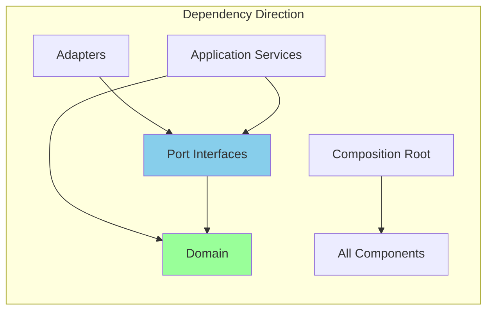
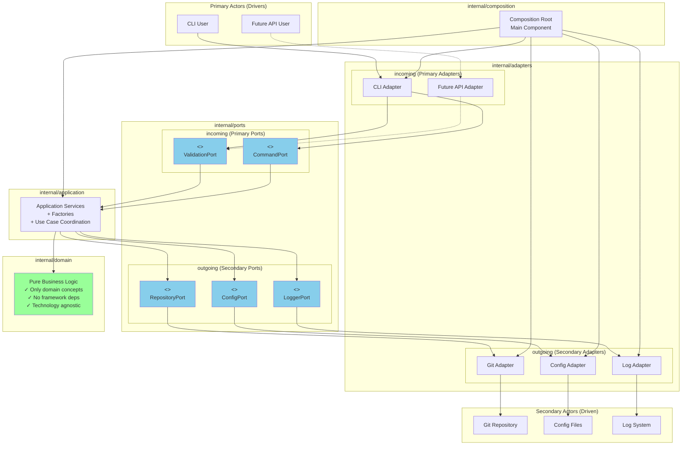
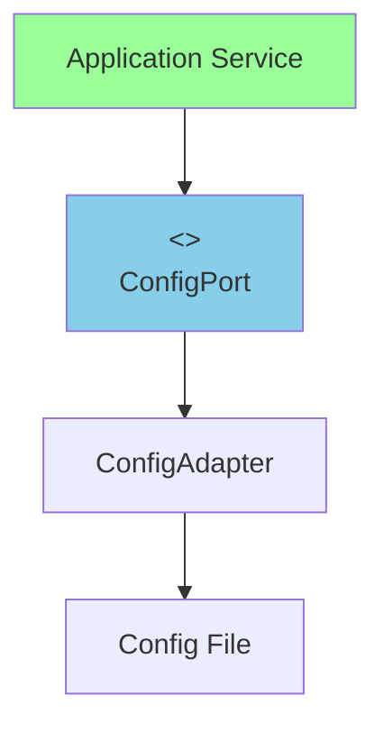
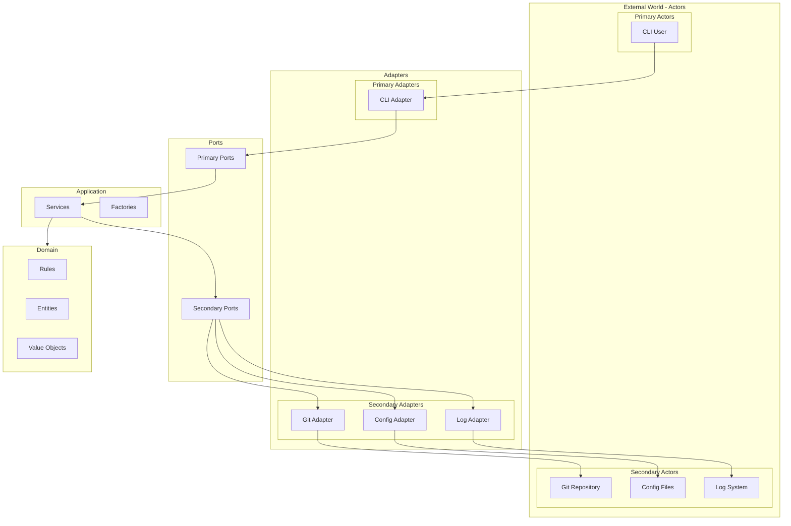

# Architecture

Gommitlint follows a **functional hexagonal architecture** with value semantics throughout, ensuring clean separation of concerns, testability, and maintainability.

## Core Principles

1. **Hexagonal Architecture** - Clear separation between domain logic and adapters
2. **Functional Programming** - Pure functions, immutability, and value semantics
3. **Single Context Pattern** - Context flows from main through the entire application
4. **Table-Driven Testing** - Consistent test patterns with `testCase` naming
5. **Domain-First Design** - Business logic is isolated from infrastructure

## Architecture Overview

### Hexagonal Architecture (Ports and Adapters)

The architecture follows the hexagonal pattern with clear separation of concerns. The hexagon represents the application itself, containing all business logic with no references to technology or frameworks.

### Actors

Outside the hexagon we have **actors** - the real world entities that interact with the application:

#### Primary Actors (Drivers)

Located on the left/top side. The interaction is triggered by the actor:

- **CLI Users**: Humans using command line interface
- **Test Frameworks**: Automated tests that validate the application

#### Secondary Actors (Driven)

Located on the right/bottom side. The interaction is triggered by the application:

- **Git Repository** (Repository type): Application reads commit information from it
- **Configuration Files** (Repository type): Application reads configuration from them
- **Log Systems** (Recipient type): Application sends log messages to them
- **Output Formatters** (Recipient type): Application sends formatted results to them

```ascii
┌───────────────────────────────────────────────────────────────┐
│                      External Layer                           │
│  CLI • API • Git Repository • Configuration                   │
├───────────────────────────────────────────────────────────────┤
│                    Adapters Layer                             │
│        incoming/              outgoing/                       │
│          cli/                   git/                          │
│          api/                   config/                       │
│                                log/                           │
├───────────────────────────────────────────────────────────────┤
│                      Ports Layer                              │
│       incoming/               outgoing/                       │
│         validation            repository                      │
│         hooks                 logger                          │
│                              output                           │
├───────────────────────────────────────────────────────────────┤
│                   Application Layer                           │
│       validate/               report/                         │
│         service                generator                      │
│       factories/                                              │
├───────────────────────────────────────────────────────────────┤
│                     Domain Layer                              │
│                   (Core Business Logic)                       │
│     Immutable Entities • Pure Rules • Value Objects           │
└───────────────────────────────────────────────────────────────┘
```

### Ports

Ports are the application boundary - interfaces that define interactions between the hexagon and the outside world. They belong to the application.

#### Primary Ports (Driver Ports)

Located on the incoming side. They define the API that the application offers:

- **ValidationService**: Port for validating commits
- **CommandExecution**: Port for executing CLI commands (install/remove hooks)

#### Secondary Ports (Driven Ports)

Located on the outgoing side. They define the SPI that the application requires:

- **CommitRepository**: Port for accessing git commits
- **ConfigurationProvider**: Port for reading configuration
- **Logger**: Port for logging operations
- **OutputFormatter**: Port for formatting results

### Adapters

Adapters connect actors to ports using specific technology. They are outside the application.

#### Primary Adapters (Driver Adapters)

Use the primary ports, converting technology-specific requests:

- **CLIAdapter**: Converts command-line input to port calls

#### Secondary Adapters (Driven Adapters)

Implement the secondary ports, converting to specific technologies:

- **GitAdapter**: Implements repository port using go-git
- **ConfigAdapter**: Implements configuration port using Viper
- **ZerologAdapter**: Implements logger port using zerolog
- **TextAdapter/JSONAdapter**: Implement output port for different formats

### Configurable Dependency Pattern

The architecture uses the Configurable Dependency pattern (generalization of Dependency Injection):

- **Primary Side**: Adapters depend on port interfaces (implemented by the application)
- **Secondary Side**: Application depends on port interfaces (implemented by adapters)

### Composition Root

The composition root (main component) is responsible for:

1. Initializing the environment
2. Creating instances of driven adapters
3. Creating the application instance with driven adapters
4. Creating driver adapter instances with the application
5. Starting the driver adapters

### Dependency Flow

Dependencies always flow inward:



### Current Architecture



## Directory Structure

```plaintext
gommitlint/
├── cmd/                    # Application entry points
├── internal/
│   ├── domain/             # Core business logic (pure)
│   ├── core/               # Business rules implementation
│   │   ├── rules/          # Validation rules
│   │   └── validation/     # Validation engine
│   ├── ports/              # Interface definitions
│   │   ├── incoming/       # Primary ports (API)
│   │   └── outgoing/       # Secondary ports (SPI)
│   ├── adapters/           # Port implementations
│   │   ├── incoming/       # Primary adapters (CLI, Test, API)
│   │   └── outgoing/       # Secondary adapters (Git, Config, Log)
│   ├── application/        # Use case orchestration
│   ├── composition/        # Composition root (main component)
│   ├── common/             # Shared utilities
│   │   ├── contextx/       # Context utilities
│   │   └── slices/         # Functional utilities
│   ├── testutils/          # Test helpers
│   └── integtest/          # Integration tests
└── docs/                   # Documentation
```

## Functional Programming Patterns

### Value Semantics

All types use value receivers and return new instances:

```go
// Immutable transformations
func (c CommitCollection) FilterMergeCommits() CommitCollection {
    filtered := slices.Filter(c.commits, func(commit CommitInfo) bool {
        return !commit.IsMergeCommit
    })
    return NewCommitCollection(filtered)
}

// Value receivers with new returns
func (r Rule) WithConfig(cfg Config) Rule {
    result := r
    result.config = cfg
    return result
}
```

### Pure Functions

Business logic is implemented as pure functions:

```go
// Pure validation logic
func ValidateSubjectLength(commit CommitInfo, maxLength int) []Error {
    if len(commit.Subject) <= maxLength {
        return nil
    }
    return []Error{
        NewError("subject_too_long", fmt.Sprintf("exceeds %d characters", maxLength)),
    }
}
```

### Separation of I/O and Logic

I/O operations are isolated in adapters:

```go
// Service method handles I/O
func (s *Service) ValidateCommit(ctx context.Context, hash string) (*Result, error) {
    commit, err := s.repo.GetCommit(hash) // I/O
    if err != nil {
        return nil, err
    }
    
    // Call pure business logic
    result := ValidateCommitPure(commit, s.rules)
    return &result, nil
}

// Pure business logic
func ValidateCommitPure(commit CommitInfo, rules []Rule) Result {
    // Pure validation without I/O
}
```

## Context Management

Gommitlint uses a single context creation pattern:

```mermaid
main.go (context.Background())
    ↓
CLI ExecuteWithContext()
    ↓
Command setup
    ↓
Application services
    ↓
Domain logic
```

Context enrichment flow:

1. Logger addition: `ctx = logger.WithContext(ctx)`
2. Configuration: `ctx = contextx.WithConfig(ctx, config)`
3. Domain options: `ctx = domain.WithCLIOptions(ctx, options)`

### Context Best Practices

✅ **Single creation point** - Only one `context.Background()` in production  
✅ **Consistent propagation** - Context flows through all layers  
✅ **Type safety** - `contextx` package provides safe operations  
✅ **No context in structs** - Except composition root (documented exception)  
✅ **First parameter** - Context always passed as first parameter  

### Context in Tests

Tests create fresh contexts for isolation:
```go
// Common pattern
ctx := context.Background()
ctx = logger.WithContext(ctx)
ctx = config.WrapAndInjectConfig(ctx, testConfig)
```

For tests that need shared setup:
```go
func TestSuite(t *testing.T) {
    ctx := testcontext.New()
    ctx = setupCommonTestData(ctx)
    
    t.Run("TestCase1", func(t *testing.T) {
        // Use shared ctx
    })
    
    t.Run("TestCase2", func(t *testing.T) {
        // Use shared ctx
    })
}
```

## Configuration Access

Always use `contextx.GetConfig(ctx)` for configuration access:

```go
// Get configuration from context
cfg := contextx.GetConfig(ctx)

// Access values
maxLength := cfg.GetInt("subject.max_length")
isRequired := cfg.GetBool("body.required")
enabledRules := cfg.GetStringSlice("rules.enabled_rules")
```

### Configuration Simplification




## Rule Priority System

Rules have three states with specific priority order:

1. **Disabled Rules** (highest priority) - Always disabled if in `disabled_rules`
2. **Enabled Rules** (second priority) - Enabled if in `enabled_rules` and not disabled
3. **Default Disabled** (third priority) - Some rules disabled by default
4. **Default Enabled** (lowest priority) - Most rules enabled by default

```yaml
gommitlint:
  rules:
    disabled_rules:
      - CommitsAhead     # Always disabled
    enabled_rules:
      - JiraReference    # Overrides default-disabled
      - SubjectLength    # Explicitly enabled
```

Default-disabled rules:

- `JiraReference` - Requires JIRA ticket references
- `CommitBody` - Validates message body
- `SignedIdentity` - Validates signed commits

## Testing Architecture

### Test Patterns

All tests use table-driven patterns:

```go
func TestValidation(t *testing.T) {
    tests := []struct {
        name        string
        input       interface{}
        expected    interface{}
        expectError bool
    }{
        {
            name:     "valid input",
            input:    "test",
            expected: "result",
        },
    }
    
    for _, testCase := range tests {
        t.Run(testCase.name, func(t *testing.T) {
            result, err := Function(testCase.input)
            require.NoError(t, err)
            require.Equal(t, testCase.expected, result)
        })
    }
}
```

### Test Organization

```plaintext
internal/
├── testutils/           # Shared test utilities
│   ├── builders/        # Test data builders
│   ├── config/          # Configuration helpers
│   └── mocks/           # Mock implementations
├── integtest/           # Integration tests
└── *_test.go            # Unit tests alongside code
```

### Test Adapters

1. **Test Adapter** - Primary adapter that uses validation ports for testing
2. **Mock Adapters** - Secondary adapters that implement driven ports for testing
3. **Integration Adapter** - Primary adapter for integration testing workflows

## Decision Matrix

### Where Does It Belong?

| Component | Location | Rationale |
|-----------|----------|-----------|
| Business Rules | `internal/domain` & `internal/core` | Pure domain logic |
| CLI Implementation | `internal/adapters/incoming/cli` | Concrete adapter |
| Git Operations | `internal/adapters/outgoing/git` | Infrastructure adapter |
| Configuration | `internal/adapters/outgoing/config` | Single adapter pattern |
| Port Interfaces | `internal/ports` | Architectural boundaries |
| Factories | `internal/application/factories` | Application concern |
| Composition | `internal/composition` | Dependency injection |
| Domain Entities | `internal/domain` | Core business concepts |
| Value Objects | `internal/domain` | Immutable domain values |
| Use Cases | `internal/application` | Application services |

### Decision Criteria

#### Is it Domain?

- **Yes if**: Core business concept, rule, or entity
- **No if**: Framework specific, I/O operation, external dependency

#### Is it a Port?

- **Yes if**: Interface defining a boundary
- **No if**: Concrete implementation

#### Is it Application Layer?

- **Yes if**: Use case coordination, orchestration, factories
- **No if**: Pure business logic or external integration

#### Is it an Adapter?

- **Yes if**: Implements a port, talks to external systems
- **No if**: Defines business rules or interfaces

### Naming Conventions

| Component | Pattern | Example |
|-----------|---------|---------|
| Domain Entity | `{Noun}` | `Commit`, `Rule` |
| Port Interface | `{Purpose}Port` | `ValidationPort`, `ConfigurationPort` |
| Adapter | `{Technology}Adapter` | `GitAdapter`, `CLIAdapter` |
| Application Service | `{UseCase}Service` | `ValidationService` |
| Factory | `{Entity}Factory` | `RuleFactory` |

### Testing Strategy by Layer

| Layer | Test Type | Mock Strategy | Focus |
|-------|-----------|---------------|-------|
| Domain | Unit | No mocks needed | Business logic |
| Ports | Contract | N/A | Interface contracts |
| Application | Integration | Mock ports | Use case flow |
| Adapters | Integration | Mock external | I/O behavior |
| Composition | E2E | Real implementations | Full flow |

## Best Practices

### DO

- ✅ Use value semantics everywhere
- ✅ Keep domain logic pure
- ✅ Separate I/O from business logic
- ✅ Test with table-driven patterns
- ✅ Use functional composition
- ✅ Access config via `contextx.GetConfig(ctx)`
- ✅ Create interfaces at consumption site, not implementation
- ✅ Follow dependency direction (inward only)
- ✅ Use composition over inheritance

### DON'T

- ❌ Use pointer receivers for domain types
- ❌ Mix I/O with business logic
- ❌ Store context in structs (except composition root)
- ❌ Create mutable state
- ❌ Use global variables
- ❌ Access config via deprecated patterns
- ❌ Put implementations in ports package
- ❌ Create interfaces for everything
- ❌ Violate dependency direction

### Common Pitfalls to Avoid

1. **Don't put implementations in ports package**
   - ❌ `ports/cli/validate.go` (implementation)
   - ✓ `ports/incoming/validation.go` (interface)

2. **Don't mix concerns in domain**
   - ❌ Domain knowing about CLI or logging
   - ✓ Pure business rules only

3. **Don't create unnecessary abstractions**
   - ❌ Interface for everything
   - ✓ Interface only at boundaries

4. **Don't violate dependency direction**
   - ❌ Domain depending on infrastructure
   - ✓ Infrastructure depending on domain

### Success Indicators

✅ **Good Signs**

- Can swap implementations easily
- Domain has no external dependencies
- Tests don't need complex mocks
- Clear separation of concerns
- Pure functions throughout domain
- Immutable data structures
- Context flows cleanly through layers

❌ **Warning Signs**

- Circular dependencies
- Domain imports infrastructure
- Ports contain implementation
- Complex dependency injection
- Mutable state in domain
- Side effects in business logic
- Mixed I/O and computation

## Example: Creating a Custom Rule

```go
// Define custom rule with value semantics
type CustomRule struct {
    BaseRule
    pattern string
}

// Pure validation function
func (r CustomRule) Validate(ctx context.Context, commit CommitInfo) []Error {
    if !matches(commit.Subject, r.pattern) {
        return []Error{
            NewError("custom_error", "subject must match pattern"),
        }
    }
    return nil
}

// Factory with functional options
func NewCustomRule(opts ...Option) CustomRule {
    rule := CustomRule{
        BaseRule: NewBaseRule("CustomRule"),
        pattern:  "default",
    }
    
    for _, opt := range opts {
        rule = opt(rule)
    }
    
    return rule
}

// Functional option
func WithPattern(pattern string) Option {
    return func(r CustomRule) CustomRule {
        r.pattern = pattern
        return r
    }
}
```

## Running the Application

```bash
# Build
make build/plain

# Test
make test

# Validate commits
gommitlint validate --git-reference=HEAD

# Install git hooks
gommitlint install-hook

# Check active rules
gommitlint validate --git-reference=HEAD -v --debug
```

## Architecture View

The architecture can be viewed as concentric layers:



This architecture ensures:

- **Testability** through isolation
- **Flexibility** through ports and adapters
- **Maintainability** through clear separation
- **Performance** through functional patterns
- **Safety** through immutability
