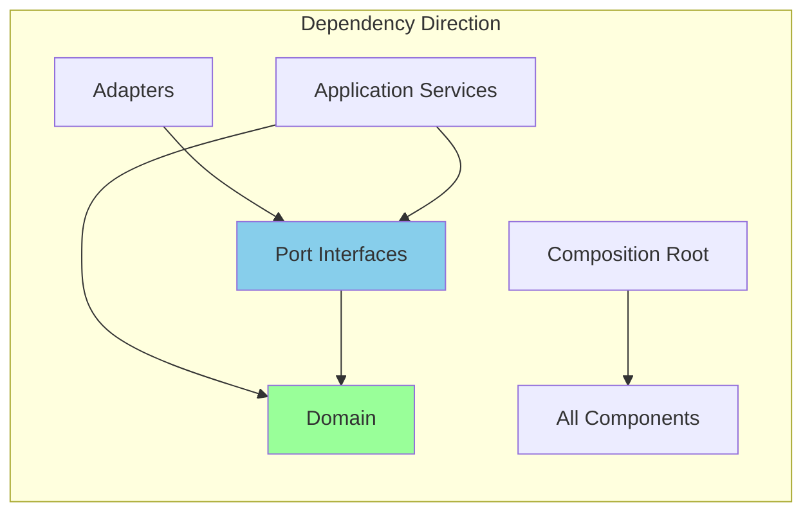
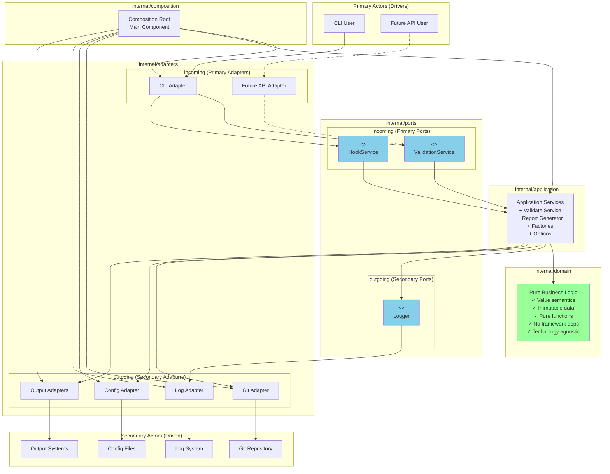
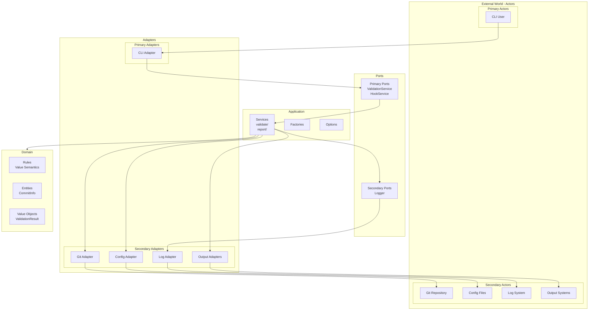

# Architecture

Gommitlint follows a **functional hexagonal architecture** with value semantics throughout, ensuring clean separation of concerns, testability, and maintainability.

## Core Principles

1. **Hexagonal Architecture** - Clear separation between domain logic and adapters
2. **Functional Programming** - Pure functions, immutability, and value semantics
3. **Single Context Pattern** - Context flows from main through the entire application
4. **Table-Driven Testing** - Consistent test patterns with `testCase` naming
5. **Domain-First Design** - Business logic is isolated from infrastructure

## Architecture Overview

### Hexagonal Architecture (Ports and Adapters)

The architecture follows the hexagonal pattern with clear separation of concerns. The hexagon represents the application itself, containing all business logic with no references to technology or frameworks.

### Actors

Outside the hexagon we have **actors** - the real world entities that interact with the application:

#### Primary Actors (Drivers)

Located on the left/top side. The interaction is triggered by the actor:

- **CLI Users**: Humans using command line interface
- **Test Frameworks**: Automated tests that validate the application

#### Secondary Actors (Driven)

Located on the right/bottom side. The interaction is triggered by the application:

- **Git Repository** (Repository type): Application reads commit information from it
- **Configuration Files** (Repository type): Application reads configuration from them
- **Log Systems** (Recipient type): Application sends log messages to them
- **Output Formatters** (Recipient type): Application sends formatted results to them

```ascii
┌───────────────────────────────────────────────────────────────┐
│                      External Layer                           │
│  CLI • API • Git Repository • Configuration                   │
├───────────────────────────────────────────────────────────────┤
│                    Adapters Layer                             │
│        incoming/              outgoing/                       │
│          cli/                   git/                          │
│          (future: api/)         config/                       │
│                                log/                           │
│                                output/                        │
├───────────────────────────────────────────────────────────────┤
│                      Ports Layer                              │
│       incoming/               outgoing/                       │
│         validation            logger                          │
│         hooks                                                 │
├───────────────────────────────────────────────────────────────┤
│                   Application Layer                           │
│       validate/               report/                         │
│         service                generator                      │
│       factories/              options/                        │
├───────────────────────────────────────────────────────────────┤
│                     Domain Layer                              │
│                   (Core Business Logic)                       │
│     Immutable Entities • Pure Rules • Value Objects           │
└───────────────────────────────────────────────────────────────┘
```

### Ports

Ports are the application boundary - interfaces that define interactions between the hexagon and the outside world. They belong to the application.

#### Primary Ports (Driver Ports) - internal/ports/incoming

These define the API that the application offers:

- **ValidationService**: Port for validating commits (`validation.go`)
- **HookService**: Port for git hook operations (`hooks.go`)

#### Secondary Ports (Driven Ports) - internal/ports/outgoing

These define the SPI that the application requires:

- **Logger**: Port for logging operations (`logger.go`)

### Adapters

Adapters connect actors to ports using specific technology. They are outside the application.

#### Primary Adapters (Driver Adapters) - internal/adapters/incoming

Use the primary ports, converting technology-specific requests:

- **cli/**: Command-line interface adapter
  - Root command setup
  - Validation command
  - Hook installation/removal commands

#### Secondary Adapters (Driven Adapters) - internal/adapters/outgoing

Implement the secondary ports, converting to specific technologies:

- **git/**: Git repository adapter using go-git
  - Repository operations
  - Commit retrieval
  - Repository analysis
- **config/**: Configuration adapter using Viper
  - Config loading
  - Environment variable support
- **log/**: Logging adapter implementations
  - Simple console adapter
- **output/**: Output formatting adapters
  - Text formatter
  - JSON formatter
  - GitHub Actions formatter
  - GitLab CI formatter

### Configurable Dependency Pattern

The architecture uses the Configurable Dependency pattern (generalization of Dependency Injection):

- **Primary Side**: Adapters depend on port interfaces (implemented by the application)
- **Secondary Side**: Application depends on port interfaces (implemented by adapters)

### Composition Root

The composition root (main component) is responsible for:

1. Initializing the environment
2. Creating instances of driven adapters
3. Creating the application instance with driven adapters
4. Creating driver adapter instances with the application
5. Starting the driver adapters

### Dependency Flow

Dependencies always flow inward:



### Current Architecture



## Directory Structure

```plaintext
gommitlint/
├── cmd/                    # Application entry points
├── internal/
│   ├── domain/             # Core business logic (pure)
│   │   ├── commit.go       # Commit entities (value semantics)
│   │   ├── rule.go         # Rule interfaces and registry
│   │   └── types.go        # Domain types
│   ├── core/               # Business rules implementation
│   │   ├── rules/          # All validation rules
│   │   └── validation/     # Validation engine
│   ├── ports/              # Interface definitions
│   │   ├── incoming/       # Primary ports (API)
│   │   │   ├── validation.go
│   │   │   └── hooks.go
│   │   └── outgoing/       # Secondary ports (SPI)
│   │       └── logger.go
│   ├── adapters/           # Port implementations
│   │   ├── incoming/       # Primary adapters
│   │   │   └── cli/        # CLI implementation
│   │   └── outgoing/       # Secondary adapters
│   │       ├── git/        # Git operations
│   │       ├── config/     # Configuration
│   │       ├── log/        # Logging
│   │       └── output/     # Output formatting
│   ├── application/        # Use case orchestration
│   │   ├── validate/       # Validation service
│   │   ├── report/         # Report generation
│   │   ├── factories/      # Rule and object factories
│   │   └── options/        # CLI and runtime options
│   ├── composition/        # Dependency injection
│   ├── common/             # Shared utilities
│   │   ├── contextx/       # Context utilities
│   │   ├── contextkeys/    # Context key definitions
│   │   └── slices/         # Functional utilities
│   ├── config/             # Configuration types
│   ├── errors/             # Error types and formatting
│   ├── testutils/          # Test helpers
│   └── integtest/          # Integration tests
└── docs/                   # Documentation
```

## Functional Programming Patterns

### Value Semantics

All domain types use value receivers and return new instances:

```go
// Immutable transformations
func (c CommitCollection) FilterMergeCommits() CommitCollection {
    filtered := slices.Filter(c.commits, func(commit CommitInfo) bool {
        return !commit.IsMergeCommit
    })
    return NewCommitCollection(filtered)
}

// Value receivers with new returns
func (r Rule) WithConfig(cfg Config) Rule {
    result := r
    result.config = cfg
    return result
}
```

### Pure Functions

Business logic is implemented as pure functions:

```go
// Pure validation logic
func ValidateSubjectLength(commit CommitInfo, maxLength int) []Error {
    if len(commit.Subject) <= maxLength {
        return nil
    }
    return []Error{
        NewError("subject_too_long", fmt.Sprintf("exceeds %d characters", maxLength)),
    }
}
```

### Implementation Notes

1. **Domain Layer**: Follows value semantics with pure functions
2. **Rule Implementation**: Rules use value receivers and receive configuration via constructor options
3. **Collection Operations**: Functional patterns with `Filter`, `Map`, `Any`, `All`
4. **Immutability**: Collections and validation results always return new instances

### Separation of I/O and Logic

I/O operations are isolated in adapters:

```go
// Service method handles I/O
func (s *Service) ValidateCommit(ctx context.Context, hash string) (*Result, error) {
    commit, err := s.repo.GetCommit(hash) // I/O
    if err != nil {
        return nil, err
    }
    
    // Call pure business logic
    result := ValidateCommitPure(commit, s.rules)
    return &result, nil
}

// Pure business logic
func ValidateCommitPure(commit CommitInfo, rules []Rule) Result {
    // Pure validation without I/O
}
```

## Context Management

Gommitlint uses a single context creation pattern:

```mermaid
main.go (context.Background())
    ↓
CLI ExecuteWithContext()
    ↓
Command setup
    ↓
Application services
    ↓
Domain logic
```

Context enrichment flow:

1. Logger addition: `ctx = logger.WithContext(ctx)`
2. Domain options: `ctx = domain.WithCLIOptions(ctx, options)`

### Context Best Practices

✅ **Single creation point** - Only one `context.Background()` in production  
✅ **Consistent propagation** - Context flows through all layers  
✅ **Type safety** - `contextx` package provides safe operations  
✅ **No context in structs** - Except composition root (documented exception)  
✅ **First parameter** - Context always passed as first parameter  

### Context in Tests

Tests create fresh contexts for isolation:
```go
// Common pattern
ctx := context.Background()
ctx = logger.WithContext(ctx)
ctx = config.WrapAndInjectConfig(ctx, testConfig)
```

For tests that need shared setup:
```go
func TestSuite(t *testing.T) {
    ctx := testcontext.New()
    ctx = setupCommonTestData(ctx)
    
    t.Run("TestCase1", func(t *testing.T) {
        // Use shared ctx
    })
    
    t.Run("TestCase2", func(t *testing.T) {
        // Use shared ctx
    })
}
```

## Configuration Access

Configuration is passed explicitly through constructor options and parameters:

```go
// Rules receive configuration during construction
rule := NewSubjectLengthRule(WithMaxLength(config.GetInt("subject.max_length")))

// Services receive configuration through constructor
service := validate.NewService(config, repository, logger)

// Access values from the config parameter
maxLength := config.GetInt("subject.max_length")
isRequired := config.GetBool("body.required")
enabledRules := config.GetStringSlice("rules.enabled")
```

### Configuration Notes

- Configuration flows through explicit parameters
- No configuration stored in context (anti-pattern)
- Rules receive configuration via constructor options
- Services receive configuration as constructor parameter

## Rule Priority System

Rules have three states with specific priority order:

1. **Enabled Rules** (highest priority) - Always enabled if in `enabled`
2. **Disabled Rules** (second priority) - Disabled if in `disabled` and not enabled
3. **Default Disabled** (third priority) - Some rules disabled by default
4. **Default Enabled** (lowest priority) - Most rules enabled by default

```yaml
gommitlint:
  rules:
    enabled:
      - JiraReference    # Overrides default-disabled
      - SubjectLength    # Explicitly enabled
    disabled:
      - CommitsAhead     # Always disabled (unless also in enabled)
```

Default-disabled rules:

- `JiraReference` - Requires JIRA ticket references
- `CommitBody` - Validates message body
- `SignedIdentity` - Validates signed commits

### Rule Priority Logic

```python
if rule in enabled:
    include rule
else if rule in disabled:
    exclude rule
else if rule in DefaultDisabledRules:
    exclude rule
else:
    include rule
```

## Testing Architecture

### Test Patterns

All tests use table-driven patterns for consistency and maintainability:

```go
func TestValidation(t *testing.T) {
    tests := []struct {
        name        string
        input       interface{}
        expected    interface{}
        expectError bool
    }{
        {
            name:     "valid input",
            input:    "test",
            expected: "result",
        },
    }
    
    for _, tt := range tests {
        t.Run(tt.name, func(t *testing.T) {
            result, err := Function(tt.input)
            require.NoError(t, err)
            require.Equal(t, tt.expected, result)
        })
    }
}
```

### Testing Principles

- ✅ Table-driven tests for all scenarios
- ✅ `testify/require` for assertions
- ✅ High test coverage (>80%)
- ✅ Integration tests for workflows
- ✅ Unit tests alongside source files

### Test Organization

```plaintext
internal/
├── testutils/           # Shared test utilities
│   ├── builders/        # Test data builders
│   ├── config/          # Configuration helpers
│   └── mocks/           # Mock implementations
├── integtest/           # Integration tests
└── *_test.go            # Unit tests alongside code
```

### Test Adapters

1. **Test Adapter** - Primary adapter that uses validation ports for testing
2. **Mock Adapters** - Secondary adapters that implement driven ports for testing
3. **Integration Adapter** - Primary adapter for integration testing workflows

## Decision Matrix

### Where Does It Belong?

| Component | Location | Rationale |
|-----------|----------|-----------|
| Business Rules | `internal/domain` & `internal/core` | Pure domain logic |
| CLI Implementation | `internal/adapters/incoming/cli` | Concrete adapter |
| Git Operations | `internal/adapters/outgoing/git` | Infrastructure adapter |
| Configuration | `internal/adapters/outgoing/config` | Single adapter pattern |
| Port Interfaces | `internal/ports` | Architectural boundaries |
| Factories | `internal/application/factories` | Application concern |
| Composition | `internal/composition` | Dependency injection |
| Domain Entities | `internal/domain` | Core business concepts |
| Value Objects | `internal/domain` | Immutable domain values |
| Use Cases | `internal/application` | Application services |

### Decision Criteria

#### Is it Domain?

- **Yes if**: Core business concept, rule, or entity
- **No if**: Framework specific, I/O operation, external dependency

#### Is it a Port?

- **Yes if**: Interface defining a boundary
- **No if**: Concrete implementation

#### Is it Application Layer?

- **Yes if**: Use case coordination, orchestration, factories
- **No if**: Pure business logic or external integration

#### Is it an Adapter?

- **Yes if**: Implements a port, talks to external systems
- **No if**: Defines business rules or interfaces

### Naming Conventions

| Component | Pattern | Example |
|-----------|---------|---------|
| Domain Entity | `{Noun}` | `Commit`, `Rule` |
| Port Interface | `{Purpose}Port` or `{Purpose}Service` | `ValidationService`, `Logger` |
| Adapter | `{Technology}Adapter` | `GitAdapter`, `CLIAdapter` |
| Application Service | `{UseCase}Service` | `ValidationService` |
| Factory | `{Entity}Factory` | `RuleFactory` |

### Testing Strategy by Layer

| Layer | Test Type | Mock Strategy | Focus |
|-------|-----------|---------------|-------|
| Domain | Unit | No mocks needed | Business logic |
| Ports | Contract | N/A | Interface contracts |
| Application | Integration | Mock ports | Use case flow |
| Adapters | Integration | Mock external | I/O behavior |
| Composition | E2E | Real implementations | Full flow |

## Best Practices

### DO

- ✅ Use value semantics everywhere
- ✅ Keep domain logic pure
- ✅ Separate I/O from business logic
- ✅ Test with table-driven patterns
- ✅ Use functional composition
- ✅ Pass configuration explicitly through parameters
- ✅ Create interfaces at consumption site, not implementation
- ✅ Follow dependency direction (inward only)
- ✅ Use composition over inheritance

### DON'T

- ❌ Use pointer receivers for domain types
- ❌ Mix I/O with business logic
- ❌ Store context in structs (except composition root)
- ❌ Create mutable state
- ❌ Use global variables
- ❌ Store configuration in context
- ❌ Put implementations in ports package
- ❌ Create interfaces for everything
- ❌ Violate dependency direction

### Common Pitfalls to Avoid

1. **Don't put implementations in ports package**
   - ❌ `ports/cli/validate.go` (implementation)
   - ✓ `ports/incoming/validation.go` (interface)

2. **Don't mix concerns in domain**
   - ❌ Domain knowing about CLI or logging
   - ✓ Pure business rules only

3. **Don't create unnecessary abstractions**
   - ❌ Interface for everything
   - ✓ Interface only at boundaries

4. **Don't violate dependency direction**
   - ❌ Domain depending on infrastructure
   - ✓ Infrastructure depending on domain

### Success Indicators

✅ **Good Signs**

- Can swap implementations easily
- Domain has no external dependencies
- Tests don't need complex mocks
- Clear separation of concerns
- Pure functions throughout domain
- Immutable data structures
- Context flows cleanly through layers

❌ **Warning Signs**

- Circular dependencies
- Domain imports infrastructure
- Ports contain implementation
- Complex dependency injection
- Mutable state in domain
- Side effects in business logic
- Mixed I/O and computation

## Implementation Status and Roadmap

### Current State

1. **Architecture Compliance**: The codebase closely follows the documented hexagonal architecture
2. **Functional Patterns**: Domain mostly uses value semantics with some pragmatic exceptions
3. **Configuration Access**: Explicit parameter passing for configuration
4. **Testing**: Good use of table-driven tests with high coverage
5. **Context Management**: Well-implemented single context pattern
6. **Rule System**: Clearly defined priority system as documented
7. **Composition**: Clean dependency injection via composition root

### Areas for Improvement

1. Continue enforcing value semantics in new code
2. Maintain hexagonal architecture boundaries
3. Keep domain logic pure and testable

## Example: Creating a Custom Rule

```go
// Define custom rule with value semantics
type CustomRule struct {
    BaseRule
    pattern string
    enabled bool
}

// Pure validation function
func (r CustomRule) Validate(ctx context.Context, commit CommitInfo) []Error {
    if !r.enabled || matches(commit.Subject, r.pattern) {
        return nil
    }
    
    return []Error{
        NewError("custom_error", "subject must match pattern"),
    }
}

// Factory with functional options
func NewCustomRule(opts ...Option) CustomRule {
    rule := CustomRule{
        BaseRule: NewBaseRule("CustomRule"),
        pattern:  "default",
        enabled:  true,
    }
    
    for _, opt := range opts {
        rule = opt(rule)
    }
    
    return rule
}

// Functional options
func WithPattern(pattern string) Option {
    return func(r CustomRule) CustomRule {
        r.pattern = pattern
        return r
    }
}

func WithEnabled(enabled bool) Option {
    return func(r CustomRule) CustomRule {
        r.enabled = enabled
        return r
    }
}
```

## Running the Application

```bash
# Build
make build/plain

# Test
make test

# Validate commits
gommitlint validate --git-reference=HEAD

# Install git hooks
gommitlint install-hook

# Check active rules
gommitlint validate --git-reference=HEAD -v --debug
```

## Architecture View

The architecture can be viewed as concentric layers:



This architecture ensures:

- **Testability** through isolation
- **Flexibility** through ports and adapters
- **Maintainability** through clear separation
- **Performance** through functional patterns
- **Safety** through immutability